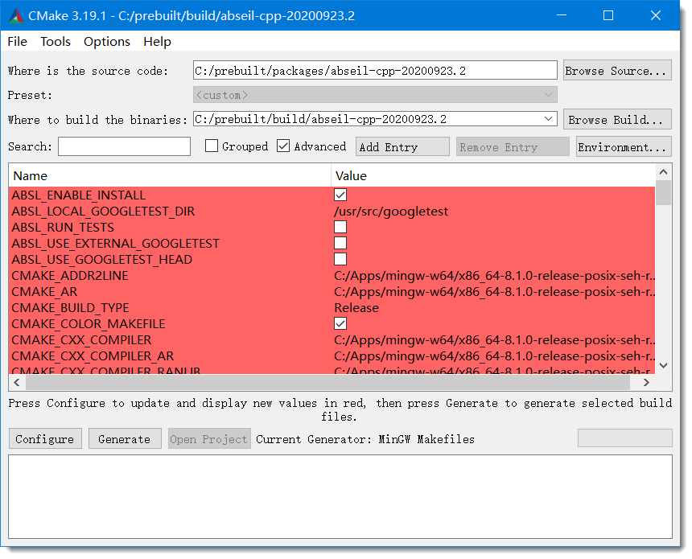
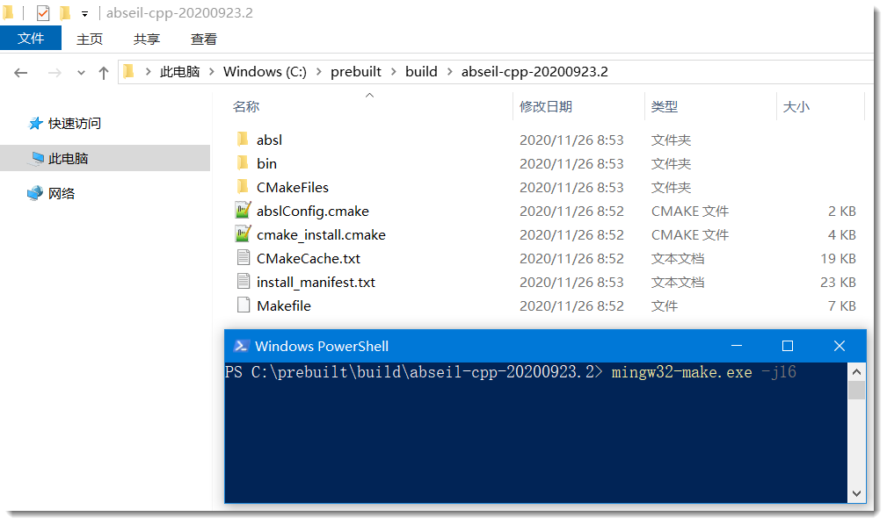

# Windows-Compile.md

在 Linux 下，有时候没有办法正常编译某些库，所以我会在 Windows 下编译它们。Windows 编译有时候就算做笔记，操作也是很繁琐的，各种参数劝退。所以，这里提供了 build.rar（很有用）和 out.rar（可能只需要用到 openssl 里面的 cmake 脚本而已）。

由于我编译时，build 路径为 C:\prebuilt\build，为什么不选择 D 盘？因为有些人的电脑没有 D 盘。

> **温馨提示**
>
> Windows 一般都会去掉 lib 前缀，即在 CMakeLists.txt 加上（一般在 peoject 后面一行）：
> set(CMAKE_SHARED_LIBRARY_PREFIX "")
> set(CMAKE_STATIC_LIBRARY_PREFIX "")
> set(CMAKE_SHARED_MODULE_PREFIX "")


以 abseil-cpp-20200923.2 编译作为示例：

- 解压 build.rar 到 C:\prebuilt\build 下

- 打开 CMake，选择源码（路径随意，我这里是 C:/prebuilt/packages/abseil-cpp-20200923.2）

- 指定 build 路径，这时就应该是 C:/prebuilt/build/abseil-cpp-20200923.2

  > 此时，你会返现下面出现了很多配置，这些配置靠笔记是不直观的，这也是提供 build.rar 的意义。
  >
  > 但是，这只能作为你的参考，因为你的编译环境可能和我的差别很大，例如 gcc 的位置就可能与我的不同。
  >
  > 提供 build.rar 只是加快了你在编译之前的操作。




当你准确就绪后，就可以点击 Configure 完成配置，点击 Generate 生成 Makefile。

如果一切顺利，此时你应该在控制台输入 mingw32-make.exe -j16 编译。

编译成功后自然通过 mingw32-make.exe install 安装。

> 如果使用 build.rar 的配置，将安装在 C:\prebuilt\out\abseil-cpp-20200923.2 路径下。




由于编译复杂性，这里提供了编译脚本，但是并不能正常工作，仅仅用于参考，见路径 for-windows[not working]。


## 有些库是仅头文件

- json
- spdlog 可以编译静态库，但是在 Windows 使用出现各种问题


## 有些库是在 Linux 交叉编译的

- libiconv

  修改编译脚本即可

  ```shell
  ./configure --host=x86_64-w64-mingw32 --prefix=${OUT_DIR}/${LIB_NAME_LIBICONV}
  ```

- openssl

  > 这样编译的结果不会有 cmake，如果需要用到 cmake 项目中，需要自己写 cmake

  ```shell
  CROSS_COMPILE="x86_64-w64-mingw32-" ./Configure mingw64 no-asm shared no-unit-test --prefix=/home/eniso/prebuilt/openssl-1.1.1g/build
  ```

- pjproject

  编译此库，需要切换代码，使用 [git-source]pjproject.tar.gz，里面包含很多修改。其中一条记录，就是去掉版本号，因为 pjproject 编译出来的动态库是带版本号的（例如：libpj.dll.2），一般 Windows 不搞这套。

  ```shell
  ./configure --host=x86_64-w64-mingw32 --prefix=$(pwd)/out --enable-shared --disable-libwebrtc --with-ssl=${OUT_DIR}/${LIB_NAME_OPENSSL}
  ```

  由于 pjproject 在 Linux 下交叉编译 Windows 出现各种问题，所以源码是被修改过的。同时还对 sdp 添加 y 字段支持。由于主开发平台不是 Windows，所以这里并没有将前缀 lib 去掉。


## protobuf

需要拷贝 zlib.dll 到 protobuf 的 bin 目录下，protoc.exe 才能正常运行


## grpc

- 需要保证 protoc.exe 正常运行

  即，到 out 路径下拷贝 zlib.dll 到 protobuf 的 bin 目录下，protoc.exe 才能正常运行

- 需要拷贝 

  > 到 out 路径下，拷贝下列库到 grpc 的编译路径下（即，C:\prebuilt\build\grpc-1.33.2），才能通过编译
  > absl.dll
  > protobuf.dll
  > protobuf-lite.dll
  > protoc.dll
  > zlib.dll


## curl

依赖 c-ares，这个目前是放在 grpc 中编译的，所以需要从 grpc 中提取到 out 路径下（即，C:\prebuilt\out\c-ares-1.17.1）

如果需要正常运行 curl.exe，还到 out 路径下将以下库考到 curl.exe 所在的目录才

> cares.dll
> libcrypto-1_1-x64.dll
> libssl-1_1-x64.dll
> zlib.dll


